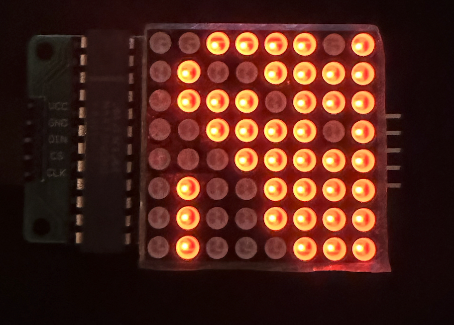
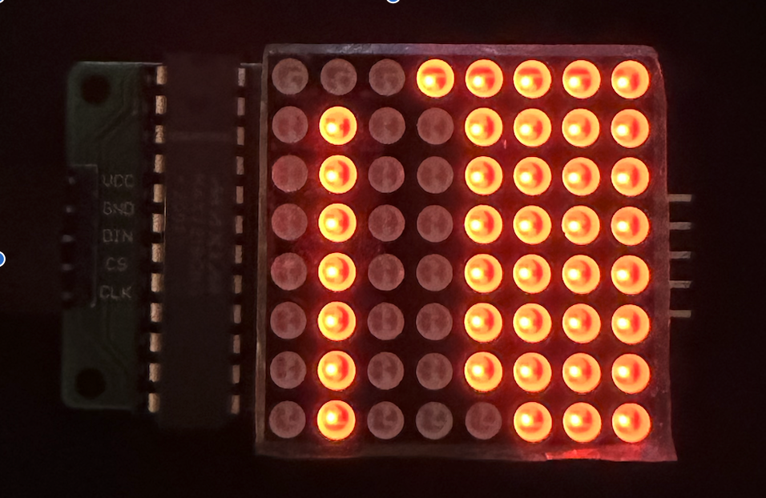

## MAX7219 Driver

The MAX7219/MAX7221 is a compact, serial input/ output common-cathode display drivers that interface microprocessors (μPs) to 7-segment numeric LED displays of up to 8 digits, bar-graph displays, or 64 individual LEDs. This driver is written in [LucidV2](https://alchitry.com/tutorials/lucid-reference/) and is meant to be run on [Alchitry Au](https://www.sparkfun.com/products/16527) Boards + [Alchitry Br](https://www.sparkfun.com/products/16524) prototype element board.

Refer to the [documentation](docs/max7219-max7221.pdf) on how it works.

### Demo

Upon compilation, connect the 3 pins of MAX7219: `data, load, clock` to Br Pins `A45, A46, A6` respectively. This connection can be found at the bottom of `au_top.luc`:

```
    io_segment[4] = max7219_driver.max7219_data; // A45
    io_segment[3] = max7219_driver.max7219_load; // A46
    io_segment[1] = max7219_driver.max7219_clock; // A6
```

You should observe your 8x8 LED matrix or 8 digit 7 segments to toggle between two values `DEADBEEF` or `BEEEEEEF`:

```
  const A = $reverse(b01110111);
  const B = $reverse(b00011111);
  const D = $reverse(b00111101);
  const E = $reverse(b01001111);
  const F = $reverse(b01000111);

  const TESTWORDS = {$reverse({B, E, E, E, E, E, E, F}), $reverse({D, E, A, D, B, E, E, F})};
```

This is `DEADBEEF`:


And this is `BEEEEEEF`:


Note that in a daisy chain, the frame intended for the last chip in the chain must be shifted first, because it has to pass through the earlier chips.

### Usage

`max7219_serial.luc` is designed to work together with `max7219_driver.luc`. `max7219_serial.luc` file receives `8*CHAIN` bit data meant to be loaded to `MAX7219` holding a daisy chain of `CHAIN` 7segs/matrices and serially produced them (MSB first) via `dout`, together with `sck` (clock) and `dout` once the entire `8*CHAIN` bits of data has been produced serially at `dout` together with its address bits.

There's one helper input: `start`, which upon `1`, tells `max7219_serial.luc` to reset and start a new transfer of data to the chained 7seg/matrices.
There's also one helper output: `busy`: which tells the user of `max7219.luc` on whether or not this module is ready to receive NEW input.

The driver file `max7219_driver.luc` receives `input segment_values[8][8*CHAIN]`, and is made to toggle between these states (you can modify to suit your project):

```
    enum States {
        INITIALIZE, // wait until max7219 is ready
        IDLE, //  wait for new input
        SEND_INITIAL_SHUTDOWN, // shut every pixel down and go to no decode and set scan to ALL digits
        SEND_SHUTDOWN, // shut every pixel down
        SEND_DISPLAY_TEST, // test all LED flash, dont use this on prod
        SEND_OFF_DISPLAY_TEST, // off flashing of LED, dont use this in prod
        SEND_NO_DECODE, // turn off decode reg and set each digit directly
        SEND_SCAN_ALL_DIGITS, // scanline register to switch on all rows (digits)
        SEND_WORD, // write 8 digits of data to DIGIT register
        SEND_TURN_ON  // turn it on again to show the latest update
    }
```

Upon startup, it will off all pixels (`SEND_INITIAL_SHUTDOWN`), set decode register to "no decode" (`SEND_NO_DECODE`), set scan register to scan (show) all digits (`SEND_NO_DECODE`) and then begin to `SEND_WORD` (send col values row by row, each to a DIGIT register). Once done, it will go to `SEND_TURN_ON` to switch all lights on, and go to `IDLE`.

At `IDLE`, it will be not `busy`, and ready to receive new input from `au_top` (watching `new` input). Similarly, the driver will give out `done` signal to indicate its user whether or not the current data has been latched and displayed.

### `CHAIN` option

You can set CHAIN to be > 1 and MAX7219 will pump out `CHAIN x 16` bits before setting `LATCH` to high before the 17th clock cycle so that all `CHAIN x 16` bits of data is latched to the corresponding matrices/segments connected via the shift register.

At any given time, you MUST pump `input segment_values[8][8*CHAIN]` accordingly, that is if you have 3 8x8 matrices in a chain, you need to give 8x24 bits of data at once via `segment_values`.

All matrices in the chain will show `DEADBEEF`, then all will toggle to `BEEEEEEF` and back and forth in the demo value written in `alchitry_top`.

### Debug

You can slow down clock in `max7219.luc` by setting the index of `slowclock.value` to be a bigger number. The minimum index is `4` as MAX7219 can work with `10MHz clock` at best.

```
    slowclock_value = slowclock.value[19]; // index 4 is minimum, because 100/2^4 Mhz = 6.125Mhz, set to higher value like 27 to debug
```
